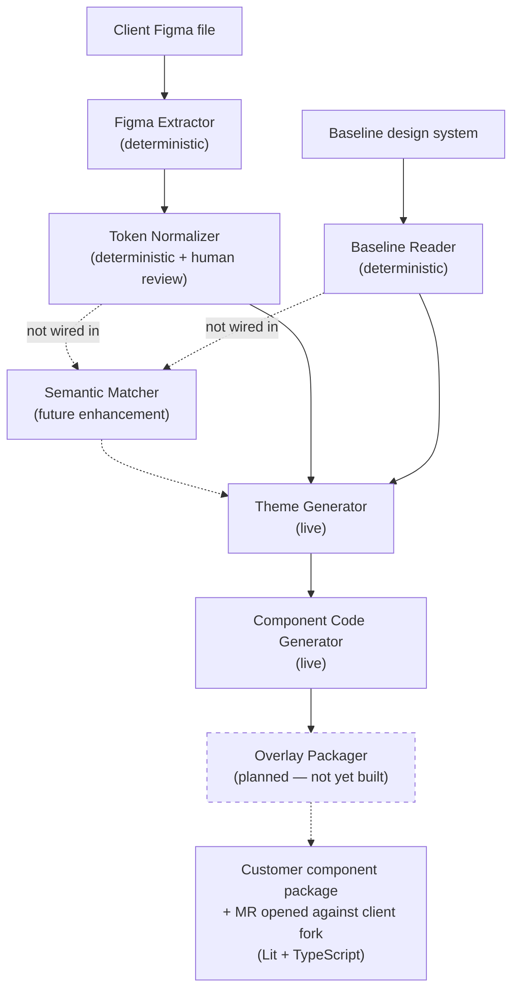

# HELIX Agents (AgentOS)

> **This repo = `helix-agents`** (HELIX PoC AgentOS; hosted on GitLab under `msq-turbo/helix-agents`,
> deployed to Coolify at `poc-agno-api.services.plygrnd.tech`). It began as the upstream
> **AgentOS Docker Template** (below, kept largely intact) — what we changed is tracked in
> [`CUSTOMIZATIONS.md`](CUSTOMIZATIONS.md).
>
> **New here?** Clone via **GitLab → Clone** (the project has been transferred before — don't trust a
> hardcoded path). Then: local dev setup → [`docs/SETUP.md`](docs/SETUP.md); AgentOS access token +
> Claude Code MCP → [`scripts/README.md`](scripts/README.md); the Figma extractor →
> [`agents/figma_extractor/README.md`](agents/figma_extractor/README.md).
>
> *(All the links above are repo-relative on purpose, so they survive the next rename/transfer.)*

---

An agent platform you build, improve, and run using coding agents.

The app itself runs **bare-metal** locally (a Python virtualenv + `uvicorn`); the only container is its
Postgres database. It runs behind your auth, with all your data in your own database. Because trace
data, agent code, system logs, and the iteration tools all live in one place, coding agents like Claude
Code can read, update, and improve the platform end-to-end.

## Built for coding agents

This codebase is designed primarily for coding agents. It comes with five prompts that cover the full agent development lifecycle:

1. **Create.** Claude asks a few questions, scaffolds the agent file, registers it in `app/main.py`, adds quick prompts to `app/config.yaml`, restarts the container, and smoke-tests via cURL. Usually 5-10 minutes for a simple agent.
2. **Improve.** Hardens and fine-tunes your agent based on its existing spec. You name the agent; Claude then derives probes from its `INSTRUCTIONS`, runs them against the live container, judges the responses, and edits until they pass — no further steering.
3. **Extend.** Add a new feature to an agent. You direct, Claude executes. Add tools, refine prompts, fix bugs. The Agno docs MCP is loaded so toolkit research is grounded in the real API.
4. **Hill Climb.** Claude runs the eval suite, diagnoses failures, and fixes what's in scope. Stops when all cases pass.
5. **Review.** Claude sweeps the repo for drift between docs, code, and config. Auto-fixes mechanical drift like stale paths and missing env vars; flags anything bigger.

You start each the same way — paste `Run docs/<name>.md` into Claude Code, with the platform
running locally. Three of the five — **Improve**, **Hill Climb**, and **Review** — then run to
completion without stopping to ask you anything (Improve just needs to be told which agent to
harden). **Create** and **Extend** are interactive by design: Create asks a few setup questions,
Extend puts you in the driver's seat.

## What's Included

| Agent | Pattern | Description |
|-------|---------|-------------|
| WebSearch | Direct tools | Search the web using Parallel SDK or keyless MCP. |
| CodeSearch | Context provider | Answer questions about this codebase. |
| Reasoning | Direct tools | Strategic advisor using `ReasoningTools` (`think`/`analyze`). |
| Knowledge | Context provider | Answers grounded in the Dark Factory knowledge base (tool-free RAG). |

> See [`CUSTOMIZATIONS.md`](CUSTOMIZATIONS.md) for how this repo diverges from the upstream agno-agi template (added agents, env-configurable embedder, deploy notes).

## The HELIX pipeline — what this project actually does

New to the project (or to Agno)? Start here. **HELIX turns a client's Figma design file into a
usable, standards-compliant design system** — the colours, spacing, fonts, and components a
front-end team can build with. It does that as a short assembly line of steps.

Two kinds of step, and the difference matters:

- **Deterministic workflow** — plain Python, **no AI/LLM involved**. Same input always gives the same
  output. Most of the pipeline is this, on purpose: reading a structured design file is a job for
  code, not a language model (an earlier LLM version invented components that weren't in the file —
  exactly what we don't want).
- **AI-assisted step** — uses a language model for judgement calls, and asks a human when it's unsure.
  Only one step needs this.

| Step | What it does, in plain terms | Kind | Status |
|---|---|---|---|
| **Figma Extractor** | Reads a Figma file and pulls its building blocks — colours, spacing, fonts, components, and its design-token catalog — into one structured inventory. | Deterministic workflow (no AI) | **Live** |
| **Client Extractor** | Same idea, for a client file: also follows the components a client borrows from shared libraries and resolves them. | Deterministic workflow (no AI) | **Live** |
| **Composition-Only Extractor** | Extractor for a standalone / unpublished file whose components live as page frames rather than a published library. | Deterministic workflow (no AI) | **Live** |
| **Token Normalizer** | Cleans the extracted tokens into a standards-compliant token tree (W3C Design Tokens), then **pauses for a person to review** before moving on. | Deterministic step (no AI) + human review | **Live** |
| **Baseline Reader** | Reads the team's existing baseline design system into an inventory, so later steps can compare a client against it. | Deterministic workflow (no AI) | **Live** |
| **Semantic Matcher** | Matches each client token/component to its closest counterpart in the baseline, with a confidence score — and asks a human when it isn't sure. | AI-assisted (the one LLM step) | Future enhancement — not part of the current pipeline |
| **Theme Generator** | Forks the baseline into a customer-specific package and works out which components map to it; for uncertain matches, a review pass uses an LLM. | Mostly deterministic + one AI-assisted review pass | **Live**, but no longer a planned station on the roadmap — see note below |
| **Component Code Generator** | Produces the actual component source: copies matched baseline components unchanged (Path A), or generates genuinely new ones from the Figma spec with an LLM (Path B). | Deterministic fork + AI-assisted generation | **Live** — Path A production-ready; Path B has run live but output quality has plateaued (see [`agents/component_code_generator/README.md`](agents/component_code_generator/README.md)) |



The **Overlay Packager** — the step that forks helix-code into a client package, applies token
values, and opens a GitLab MR — is planned but not yet built. The pipeline today produces component
code; delivery to a client repo is a future step.

> **Note on Semantic Matcher:** it's a tested library (`agents/semantic_matcher/`), not a registered
> workflow — there's no `app/main.py` entry, no Agno `step.py`, nothing callable over MCP/REST today.
> The pipeline runs fully today without it. It's a planned quality enhancement (automated matching to
> replace what's currently done another way), not a missing dependency — your runs will not fail
> because of it.

> **Note on Path-A vs Path-B selection (Component Code Generator):** this is a deterministic,
> caller-supplied choice, not something the pipeline infers for you. Each element you pass in
> `additional_data.elements` carries a `derivation` field; `route_element()`
> ([`agents/component_code_generator/scaffolding.py:48`](agents/component_code_generator/scaffolding.py))
> routes `derivation in ("forked_from_baseline", "agent_reconciled")` + a resolvable `baseline_ref` to
> **Path A** (fork the matched baseline component verbatim), anything else to **Path B** (generate
> from spec). `derivation` is normally set by the Theme Generator's own classification
> (`agents/theme_generator/scaffolding.py:185`), which in turn reads `scoring_by_slot` — the Semantic
> Matcher's output. **Since Semantic Matcher isn't wired (above), nothing populates `scoring_by_slot`
> today**, so every element defaults to Path B unless you explicitly supply `derivation` yourself.
> Example, to force Path A for a component you know matches an existing baseline element:
> ```json
> {"elements": [{"slot": "hero-teaser", "derivation": "forked_from_baseline", "baseline_ref": "HeroTeaser"}]}
> ```
> Tested: [`tests/component_code_generator/test_ccg_phase1.py:157-173`](tests/component_code_generator/test_ccg_phase1.py).

Each live step is an Agno **workflow** you can call over HTTP; the deep-dive for each lives in its own
README under [`agents/`](agents/) (each opens with a plain-language glossary). Architecture overview:
[`docs/ARCHITECTURE.md`](docs/ARCHITECTURE.md).

> **Note on Theme Generator:** its code is deployed and still runs. But the roadmap no longer treats
> it as a separate pipeline station — the customer-branding work it did is being folded into the
> not-yet-built overlay packager instead (see `docs/ARCHITECTURE.md`'s Architecture B section).
> Don't build on top of this step; treat it as a historical stopgap, still callable but not the
> long-term design.

> **Input scope:** HELIX accepts **Figma files** as input, and only Figma files — a client's
> Storybook is not a supported pipeline input. The three extractor workflows above are the only
> entry points. (Storybook does appear later, but only on the *output* side, and it isn't built yet:
> per the architecture, the design system — tokens → components → CSS — is the single source of
> truth, and Storybook is a presentation layer over it, not an input. Story generation is planned
> as part of the not-yet-built overlay packager, Phase 3+.)

### Which extractor workflow do I use?

There are three extractor workflows because a Figma design file can be one of three shapes. Pick by how
the file uses components:

- **A published library** — this file *publishes* components (they show up in other files' Assets panel
  for reuse; our own **Core** foundation is this). → **`helix-figma-extractor`** (message = just the file
  key).
- **A file that *uses* components from another published library** — typical client work: the file
  borrows components from a shared library, so you need that library's key too. → **`helix-client-extractor`**
  (message = `core=<source-library-key> client=<this-file-key>`).
- **A self-contained file** — no publishing, no borrowed/remote components; everything is local, and the
  components live as frames on pages. → **`helix-composition-only-extractor`** (message = just the file key).

**How to tell which, in Figma:** open the file and look at the right-hand **Assets** panel.
- Components with a small **library/link icon** = borrowed from a remote library → *client extractor*.
- Only **local** components (no link icon), nothing published = *composition-only*.
- The file **publishes** its own components to a library = *published library* → *figma-extractor*.

Picking the wrong one usually returns an empty/`failure` result rather than an error — e.g. running the
published-library extractor on a client composition finds no published component sets and comes back with
nothing. If a run is unexpectedly empty, re-check this list first.

### How to read a run result

You call a workflow and get back a run object (JSON). Here's how to read it without asking the team.

**Where the result lives.** The MCP `run_workflow` call returns the whole run object. The actual
extraction sits under `step_results → the "extract" step → content`; that content carries the
`deterministic_extraction` block described below. (Over REST it's the same object:
`GET /workflows/<id>/runs/<run_id>?session_id=<sid>`.) Underneath, that object is stored as part of
the workflow's session row in Postgres (table `agno_sessions`, `agentos-db`) — there's no separate
"runs" table and no result file written to disk; the REST/MCP call above is the supported way to
read it, not a direct DB query.

**Top-level `status`:**
- **`success`** — everything the file offered was extracted. Consume it.
- **`partial`** — most of it came through, but some pieces failed (e.g. a few component sets, or 2 of 25
  remote references). Safe to consume *with caveats* — check `failure_reports` to see what's missing.
- **`failure`** — nothing usable came back. Read `failure_reports` for the reason; don't consume.

**The four fields to check, in order:**
1. **`status`** — the headline (above).
2. **`failure_reports[]`** — *why* things went wrong. Each entry has an `error_class`, an `http_status`,
   and a `message`. This is where you look first when `status` isn't `success`.
3. **`coverage_report`** — *what* was and wasn't extracted: `component_sets_expected` vs
   `component_sets_extracted`, styles, assets. (e.g. expected 30 / extracted 28 = two sets failed — see
   `failure_reports`.)
4. **`warnings[]`** — non-blocking notes worth knowing, but not failures.

**`error_class` glossary — what it means + what to do:**

| `error_class` | Typically | What to do |
|---|---|---|
| `file_export_disabled` (403) | The Figma file has content-protection ("File not exportable") turned on | Ask the **file owner** to disable export protection. No retry helps. |
| `rate_limit_exhausted` (429) | Figma throttled a request and our backoff was used up | Wait a bit and re-run. If it keeps happening, ping the HELIX team lead. |
| `account_level_rate_limit` (429) | Figma is throttling the whole account/PAT, not one file | Wait longer before retrying; if persistent, the HELIX team lead. |
| `roster_unavailable` | The file's component roster came back empty (and it wasn't a 429) | Check the file key is right and the PAT can see the file; then re-run. |
| `auth` (401) | The PAT is invalid or lacks access to this file | Check your `FIGMA_PAT` and that it has access to the file. |
| `malformed` | Figma returned something unparseable (often an error page) | Usually transient or an access issue — re-run once; if it persists, escalate. |
| `empty_response` | A call returned 200 but with no usable content | Re-run once; if it persists, escalate. |
| `server_error` (5xx, and other unexpected statuses incl. 404) | A Figma-side error, or a wrong/deleted file key (404 lands here) | For a 404, verify the file key. For 5xx, retry; escalate if persistent. |

*(These are the exact classes the extractor emits — there's no separate `not_found`; a 404 surfaces as
`server_error` with the real `http_status` recorded.)*

**For the composition / client workflows** (`helix-client-extractor`, `helix-composition-only-extractor`)
there's also a **`resolution_summary`** + **`resolution_events`** — the trace of matching this file's
remote component references back to their source library. Read it as *N total → M resolved → K
unresolved*; e.g. `25 total, 23 resolved (92%)` is healthy, and the `K` unresolved usually means those
references point at a library we didn't register (or can't access) — verify the source-library key.

**When to escalate vs retry:** `rate_limit_exhausted` / `server_error` / `malformed` / `empty_response`
are usually transient — **retry first**. `file_export_disabled` and `auth` are **access** problems that
won't fix themselves — sort the file's export setting / your PAT, or ask the file owner. If a retry
doesn't clear a transient class, bring it to the HELIX team lead.

### Recommended MCP clients

HELIX exposes an **MCP interface**, and extractor outputs are structured JSON with rich diagnostics
(above). To read those results *conversationally* instead of parsing JSON by hand, drive HELIX from an
MCP-capable LLM client.

**Validated against HELIX:**
- **Claude Code** — used daily to build and run this pipeline; its MCP integration is confirmed against
  the deployed workflows.

**MCP-capable, should work, not yet tested against HELIX:**
- **GitHub Copilot** (MCP support in Copilot Chat), **Cursor**, **Continue.dev**, **Zed** — all speak MCP
  in principle; none has been exercised against HELIX's workflows yet.

**Direct MCP invocation** (a Python MCP client, the MCP Inspector) works too, but hands you raw JSON with
no interpretation — use the [How to read a run result](#how-to-read-a-run-result) guide above to parse it.

If you try HELIX from a client that isn't on the validated list and it works (or breaks), tell Dirk or the
HELIX team lead — we'll move it up the list.

## Get Started

Two different starting points, depending on what you're here to do:

### I want to USE the HELIX pipeline

You don't need to run anything locally. HELIX is already deployed — connect an MCP-capable client
(Claude Code, etc.) to `poc-agno-api.services.plygrnd.tech` and call the workflows directly.

- **Get a token + wire up Claude Code:** [`scripts/README.md`](scripts/README.md).
- **Full usage guide** (MCP tool catalog, per-workflow invocation, worked examples):
  [`docs/AGNO_DEV_GUIDE.md`](docs/AGNO_DEV_GUIDE.md).
- **Which workflow to call, and how to read what it returns:** see
  [Which extractor workflow do I use?](#which-extractor-workflow-do-i-use) and
  [How to read a run result](#how-to-read-a-run-result) above.

That's the whole setup. Everything below this point is for people changing the platform itself.

### I want to DEVELOP or CONTRIBUTE agents

For that you need the platform running locally.

**Run it.** The full, verified walkthrough (prerequisites, database, model access, troubleshooting)
is in [`docs/SETUP.md`](docs/SETUP.md) — it takes a clean clone to a running server. The short
version, against a **bare-metal Postgres** (this team's setup, [`docs/SETUP.md` §5 Option A](docs/SETUP.md)):

```sh
# Clone via GitLab → Clone (the project has been transferred before — don't trust a hardcoded path)
cd helix-agents

./scripts/venv_setup.sh && source .venv/bin/activate   # Python venv + deps (needs uv)
cp .env.example .env                                    # then fill in the placeholders

# create the ai/ai database + pgvector extension on your local Postgres — see docs/SETUP.md §5
dotenv run -- uvicorn app.main:app --reload --port 8000 # the app, bare-metal
```

No local Postgres at all? `docker compose -f docker-compose.dev.yml up -d` starts one (the only
container this repo uses in local dev) — see [`docs/SETUP.md` §5 Option B](docs/SETUP.md) — but it's
a fallback, not the supported path here.

Confirm it's up: `curl -sf http://localhost:8000/health` returns `200` (no auth in local dev). The API
docs are at [http://localhost:8000/docs](http://localhost:8000/docs). To point Claude Code at your
local server: `claude mcp add --transport http --scope user agno-local --url http://localhost:8000/mcp`
— no `Authorization` header needed here, unlike the prod wiring in
[`scripts/README.md`](scripts/README.md) (local dev has no auth at all; prod requires the Bearer JWT
that script mints).

**Stop it.** `Ctrl-C` in the server's terminal. To stop the database too:

```sh
docker compose -f docker-compose.dev.yml down     # add -v to also wipe the data
```

## Extending the Platform

### Multi-agent teams and workflows

For most things one agent is enough. When it isn't:

- **[Multi-agent teams](https://docs.agno.com/teams/overview).** Coordinate (a leader plans and synthesizes), route (a router picks the right specialist), or broadcast (run everyone in parallel). Use when the right specialist isn't known up front.
- **[Agentic workflows](https://docs.agno.com/workflows/overview).** Deterministic step-by-step pipelines. Use when a process needs to run the same way every time.

Rule of thumb: agents for open questions, teams for routing, workflows for processes.

### Scheduled tasks

`scheduler=True` is on in [`app/main.py`](app/main.py). Schedule any agent or workflow on a cron:

- **Maintenance.** Purge sessions older than 90 days. Vacuum tables.
- **Proactive runs.** Every weekday morning, summarize overnight news for your portfolio and send to Slack.
- **Periodic re-evaluation.** Wrap the eval suite as a scheduled workflow to catch behavior drift before users do.

> Not to be confused with **GitLab CI/CD Pipeline Schedules** (e.g. the daily `build-cem` run —
> see [`docs/ENV.md`](docs/ENV.md)), a separate mechanism configured in GitLab, not here.

See [Agno scheduler docs](https://docs.agno.com/agent-os/scheduler) for the cron API.

### Interfaces

Agents should live where your users are. Slack, Discord, Telegram, custom UIs in your product.

**Slack** is pre-wired. Set `SLACK_BOT_TOKEN` and `SLACK_SIGNING_SECRET` in your `.env` and the interface lights up automatically. See [`app/main.py`](app/main.py):

```python
interfaces: list = []
if SLACK_BOT_TOKEN and SLACK_SIGNING_SECRET:
    from agno.os.interfaces.slack import Slack

    interfaces.append(
        Slack(
            agent=code_search,
            streaming=True,
            token=SLACK_BOT_TOKEN,
            signing_secret=SLACK_SIGNING_SECRET,
            resolve_user_identity=True,
        )
    )
```

Swap the `agent=` arg to route Slack to a different agent. For the Slack-side app setup, see the [Agno Slack docs](https://docs.agno.com/agent-os/interfaces/slack/introduction).

For Discord, Telegram, WhatsApp, or a custom UI, mirror the same conditional with the relevant interface from Agno. See the [Agno interfaces guide](https://docs.agno.com/agent-os/interfaces/overview).

### Tools and MCP servers

The WebSearch agent in [`agents/web_search.py`](agents/web_search.py) shows the MCPTools pattern (URL plus transport). Copy it to wire any MCP server.

For built-in toolkits, Agno ships 100+. A typical wire-up is three lines:

```python
from agno.tools.linear import LinearTools

linear_agent = Agent(
    id="linear",
    model=default_model(),
    tools=[LinearTools()],
    instructions="You triage issues in Linear.",
    db=get_postgres_db(),
)
```

See [Agno tools](https://docs.agno.com/tools/toolkits) for the full catalog.

## Common Tasks

### Add your own agent

1. **Hand it to Claude Code** — paste `Run docs/create-new-agent.md` into a Claude Code session. Claude asks what the agent should do, generates the file, registers it, smoke-tests it.

2. **Do it manually** — create `agents/my_agent.py`:

```python
from agno.agent import Agent

from app.settings import default_model
from db import get_postgres_db

my_agent = Agent(
    id="my-agent",
    name="My Agent",
    model=default_model(),
    db=get_postgres_db(),
    instructions="You are a helpful assistant.",
    enable_agentic_memory=True,
    add_datetime_to_context=True,
    add_history_to_context=True,
    num_history_runs=5,
    markdown=True,
)
```

Register in `app/main.py`. With `uvicorn --reload` running, saving the file reloads it automatically; otherwise restart the `uvicorn` process.

### Add tools to an agent

Agno includes 100+ tool integrations. See the [full list](https://docs.agno.com/tools/toolkits).

```python
from agno.tools.slack import SlackTools
from agno.tools.google_calendar import GoogleCalendarTools

my_agent = Agent(
    ...
    tools=[
        SlackTools(),
        GoogleCalendarTools(),
    ],
)
```

### Add dependencies

```sh
# 1. Edit pyproject.toml
# 2. Regenerate requirements
./scripts/generate_requirements.sh upgrade
# 3. Reinstall into the venv, then restart uvicorn
pip install -r requirements.txt
```

### Use a different model provider

1. Add your API key to `.env` (e.g., `ANTHROPIC_API_KEY`)
2. Update `app/settings.py`:

```python
from agno.models.anthropic import Claude

def default_model():
    return Claude(id="claude-sonnet-4-5")
```

3. Add dependency to `pyproject.toml`

## Environment Variables

| Variable | Required | Default | Description |
|----------|----------|---------|-------------|
| `OPENAI_API_KEY` | Yes | - | OpenAI API key |
| `RUNTIME_ENV` | No | `prd` | `dev` enables hot-reload and disables JWT |
| `JWT_VERIFICATION_KEY` | Prd | - | RSA **public** PEM that verifies minted access tokens (see `docs/AUTH_KEYS.md`) |
| `OPENAI_BASE_URL` | Dev/Prd | - | LiteLLM proxy URL |
| `OPENAI_EMBEDDER_ID` | No | `openai/text-embedding-3-small` | Keep the `openai/` prefix on LiteLLM |
| `AGENTOS_URL` | No | `http://127.0.0.1:8000` | Scheduler base URL |
| `PARALLEL_API_KEY` | No | - | Parallel SDK key (optional for WebSearch) |
| `SLACK_BOT_TOKEN` | No | - | Enable Slack interface |
| `SLACK_SIGNING_SECRET` | No | - | Enable Slack interface |
| `DB_HOST` | No | `localhost` | Database host |
| `DB_PORT` | No | `5432` | Database port |
| `DB_USER` | No | `ai` | Database user |
| `DB_PASS` | No | `ai` | Database password |
| `DB_DATABASE` | No | `ai` | Database name |

## Learn More

- [Agno Documentation](https://docs.agno.com)
- [AgentOS Documentation](https://docs.agno.com/agent-os/introduction)
- [Agno Discord](https://agno.com/discord)
