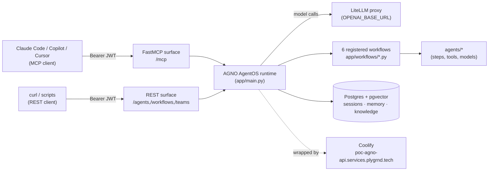

# AGNO Developer Guide

> **Audience:** internal devs extending this repo. Read this before touching `app/main.py`,
> `agents/`, or the MCP surface. Replaces the old pointer to `~/.claude/skills/agno-dev/` — that
> directory lives only on one developer's machine and is not part of this repo.

## 1. What AGNO is

This repo is **HELIX implemented on top of Agno AgentOS** — a running service, not a framework
you fork. Agno is the Python library (agents, workflows, sessions, memory, knowledge); **AgentOS**
is the FastAPI app it builds (`app/main.py`) that serves those agents/workflows over REST and MCP.
The service is already deployed and running at `poc-agno-api.services.plygrnd.tech`
(Coolify-managed). Day-to-day work is either (a) calling it as a client, or (b) adding a new
agent/workflow to `app/main.py` and letting the running deploy pick it up on the next push to
`main`. There is no separate "framework repo" to upgrade — Agno is a pinned dependency
(`requirements.txt`).

## 2. Platform architecture



- **LiteLLM proxy** — every model call (agents, embeddings) routes through it; see `OPENAI_BASE_URL`
  / `OPENAI_API_KEY` in `AGENTS.md`'s Environment Variables table.
- **FastMCP surface** — mounted at `/mcp` (streamable-HTTP transport, session-based — see §3).
  Confirmed empirically 2026-08-06; do not assume `/helix/mcp`, that path 404s.
- **REST surface** — `/agents/{id}/runs`, `/workflows/{id}/runs`, `/teams/{id}/runs`, plus
  `/health`, `/agents`, `/config`.
- **Postgres + pgvector** — one `PostgresDb` (id `agentos-db`, see `db/session.py`) backs sessions,
  memory, and knowledge (vector search via pgvector).
- **Coolify** — wraps the whole service; deploy = `git push` to `main` (see §6).

## 3. Connecting to the live platform

### Mint a token and wire it into Claude Code

Full walkthrough: [`scripts/README.md`](../scripts/README.md). Short version:

```bash
# Fastest: GitLab CI self-serve (no key handling)
# GitLab -> Build -> Pipelines -> Run pipeline on main, set MINT_USER=<handle>
# -> download the mint-token job's agno_mcp_token artifact -> save to ~/.agno-keys/agno_mcp_token

claude mcp add --transport http --scope user agno-prod \
  https://poc-agno-api.services.plygrnd.tech/mcp \
  --header "Authorization: Bearer $(cat ~/.agno-keys/agno_mcp_token)"
claude mcp list          # agno-prod ... (HTTP) - Connected
```

Reload the window, run `/mcp`, and confirm the `agno-prod` tools appear (`mcp__agno-prod__*`).

**Note:** `scripts/README.md`'s troubleshooting section suggests smoke-testing with a `whoami`
tool. As of this writing, `whoami` is **not** in the MCP tool catalog (confirmed below) — use
`get_agentos_config` as the connectivity smoke test instead.

### MCP tool catalog

Enumerated live via `tools/list` against `https://poc-agno-api.services.plygrnd.tech/mcp`
(2026-08-06, AgentOS v3.4.2). The MCP surface exposes **19 tools** — a subset of the REST surface,
scoped to running things and managing sessions/memory. There is no `whoami`, no per-agent/workflow
listing tool (use `get_agentos_config` for that), and no delete-all-memories-by-user helper.

| Tool | Signature | Description |
|------|-----------|--------------|
| `get_agentos_config` | `get_agentos_config()` | Full AgentOS config: registered agents/teams/workflows, interfaces, DB ids. Best MCP-side connectivity + discovery check. |
| `run_agent` | `run_agent(agent_id, message)` | Run an agent with a message. |
| `run_team` | `run_team(team_id, message)` | Run a team with a message. |
| `run_workflow` | `run_workflow(workflow_id, message)` | Run a workflow with a message. **No `additional_data`, no `background` — see §4.** |
| `get_sessions` | `get_sessions(db_id, session_type="agent", component_id?, user_id?, session_name?, limit=20, page=1, sort_by="created_at", sort_order="desc")` | Paginated session list. |
| `get_session` | `get_session(session_id, db_id, session_type="agent", user_id?)` | Fetch one session. |
| `create_session` | `create_session(db_id, session_type="agent", session_id?, session_name?, session_state?, metadata?, user_id?, agent_id?, team_id?, workflow_id?)` | Create a session. |
| `get_session_runs` | `get_session_runs(session_id, db_id, session_type="agent", user_id?)` | All runs for a session — how you retrieve a `background=true` run's result over REST; not exposed as a background flag over MCP (see §4). |
| `get_session_run` | `get_session_run(session_id, run_id, db_id, session_type="agent", user_id?)` | One run from a session. |
| `rename_session` | `rename_session(session_id, session_name, db_id, session_type="agent", user_id?)` | Rename a session. |
| `update_session` | `update_session(session_id, db_id, session_type="agent", session_name?, session_state?, metadata?, summary?, user_id?)` | Update session name/state/metadata/summary. |
| `delete_session` | `delete_session(session_id, db_id, user_id?)` | Delete a session + its runs. |
| `delete_sessions` | `delete_sessions(session_ids, db_id, session_types?, user_id?)` | Bulk delete sessions. |
| `create_memory` | `create_memory(db_id, memory, user_id, topics?)` | Create a user memory. |
| `get_memory` | `get_memory(memory_id, db_id, user_id?)` | Fetch one memory. |
| `get_memories` | `get_memories(db_id, user_id?, agent_id?, team_id?, topics?, search_content?, limit=20, page=1, sort_by="updated_at", sort_order="desc")` | Paginated memory list/search. |
| `update_memory` | `update_memory(db_id, memory_id, memory, user_id, topics?)` | Update a memory. |
| `delete_memory` | `delete_memory(db_id, memory_id, user_id?)` | Delete one memory. |
| `delete_memories` | `delete_memories(memory_ids, db_id, user_id?)` | Bulk delete memories. |

Full usage patterns for `run_workflow` against each of the six HELIX workflows: §4 below.

## 4. Invoking HELIX workflows

Six workflows are registered in `app/main.py` (`app/workflows/*.py`). All take a **single string
`message`** (Agno workflows accept one string input) — parameters beyond `message` go through
`additional_data`, which is a **REST-only** parameter (see the callout below).

| Workflow ID | Message grammar | MCP vs REST |
|---|---|---|
| `helix-figma-extractor` | Figma file URL or bare 20-40 char file key (published-library file) | Either. Has a HITL (human-in-the-loop) output-review pause at the `normalize` step — the run won't complete until reviewed. |
| `helix-client-extractor` | `core=<library-key> client=<file-key>` (or two bare keys, first=core/second=client), optional `additional=<k1,k2>` and `freshness=<days>` | REST + `background=true` recommended — sustained-429 retry can push the run to ~4 min. |
| `helix-composition-only-extractor` | Figma file URL or bare file key (self-contained/unpublished file) | REST + `background=true` recommended, same 429-retry reason. |
| `helix-baseline-reader` | Any non-empty string (the step is deterministic and ignores `message`; behavior is controlled by env + optional `additional_data.baseline_ref`) | Either — MCP works fine when you don't need to override `baseline_ref` (defaults to `master`). |
| `helix-theme-generator` | Any non-empty string — **all real inputs are required `additional_data` fields** (`baseline`, `client_extraction`, `scoring_by_slot`; optional `customer_slug`, `scope`, `output_dir`) | **REST-only.** MCP's `run_workflow` schema has no `additional_data` parameter — confirmed by direct probe (see below). Calling it over MCP will run with no inputs and fail validation. |
| `helix-component-code-generator` | Any non-empty string — **all real inputs are required `additional_data` fields** (`customer_slug`, `scope`, `elements`; optional `tokens_json`, `helix_code_root`, `output_dir`) | **REST-only**, same reason. |

### `additional_data` over MCP — empirically REST-only

Direct probe against `run_workflow` via MCP (2026-08-06):

```json
{"name":"run_workflow","arguments":{"workflow_id":"helix-figma-extractor","message":"probe-test","additional_data":{"test":true}}}
```

Result:

```
1 validation error for call[run_workflow]
additional_data
  Unexpected keyword argument [type=unexpected_keyword_argument, ...]
```

The MCP tool's `inputSchema` is `{"workflow_id": str, "message": str}` with
`"additionalProperties": false` — it rejects any extra field outright. `additional_data` (and
`background`) only exist on the **REST** endpoint (`POST /workflows/{id}/runs`, form/JSON body).
**Practical rule:** if a workflow's real inputs live in `additional_data` (theme-generator,
component-code-generator, and any `baseline_ref` override on the other four), you must call it
over REST, not MCP.

### Worked example 1 — `helix-figma-extractor` via Claude Code (MCP)

```
Use mcp__agno-prod__run_workflow with workflow_id="helix-figma-extractor" and
message="<figma-file-url-or-key>".
```

What happens: `extract` (deterministic Figma pull) and `baseline-read` (Agent 3a) run in parallel,
then `normalize` converts extracted tokens to DTCG and **pauses for human review** (HITL gate —
the run will sit in a review-pending state; there is no "reject" callback here, it is an approve
gate), then a smoke-test step confirms cross-step data access. Poll the run with
`mcp__agno-prod__get_session_run` (session/run ids come back in the initial `run_workflow`
response) until the review is resolved.

### Worked example 2 — `helix-baseline-reader` via Claude Code (MCP)

```
Use mcp__agno-prod__run_workflow with workflow_id="helix-baseline-reader" and
message="read baseline".
```

`message` content doesn't matter here — the step is a deterministic, zero-LLM pull-on-invocation
read of the `helix-code` baseline (tokens/components/storybook via the CI-built Custom Elements
Manifest at `HELIX_CODE_CEM_PATH`), configured entirely by env vars
(`BASELINE_REPO_URL`/`BASELINE_REPO_USERNAME`/`BASELINE_REPO_TOKEN`/`BASELINE_REPO_PATH`). It
defaults to `baseline_ref="master"`; to read a different branch/tag/sha you must go over REST with
`additional_data={"baseline_ref": "<ref>"}` — MCP cannot express that override (§4 above). Expect
a few seconds for the checkout; `blocking_warnings` (e.g. `CEM_MISSING`) surface in the result
rather than raising.

## 5. Developing a new agent

**Two different things share the word "agent" here — know which one you're building:**

- A **simple chat agent** (like `agents/web_search.py`, `agents/code_search.py`) — one file, an
  `Agent(...)` with `model` + `tools` + `instructions`, registered directly in `AgentOS(agents=[...])`.
  Follow [`docs/create-new-agent.md`](create-new-agent.md) end to end for this case — it already
  covers the full ask-the-user / generate / register / restart / smoke-test loop.
- A **HELIX pipeline agent/workflow** (like `agents/component_code_generator/`,
  `agents/theme_generator/`, `agents/baseline_reader/`) — a subpackage with deterministic step
  logic plus an `Agno Workflow` wired in `app/workflows/`. This is the pattern below.

### Anatomy

- **Agent** = system prompt (`INSTRUCTIONS`) + `tools=[...]` + model config
  (`app.settings.default_model()`, or `OpenAIChat` specifically if the agent has `tools`, per
  `AGENTS.md`'s gotcha).
- **Workflow** = a chain of `Step`s (deterministic Python executors and/or agents), optionally
  `Parallel(...)`, registered as an Agno `Workflow(id=..., steps=[...])` in `app/workflows/`, then
  listed in `AgentOS(workflows=[...])` in `app/main.py`.
- Code for a HELIX pipeline stage lives in `agents/<name>/` (its logic) + `app/workflows/<name>.py`
  (the thin `Workflow(...)` wiring that registers it as an endpoint).

### Spec-driven pattern

Write the spec first (inputs, outputs, invariants, failure modes), then implement against it —
this is how every existing HELIX stage was built (see the `spec:` references in
`app/workflows/*.py` docstrings, e.g. `spec figma-extractor-deterministic-v0-1`). Don't scaffold
speculative structure ahead of a concrete spec (KISS/YAGNI) — build the step that's specified, not
steps you imagine future phases might need.

### Verification gate

Every HELIX agent subpackage carries its own **`VERIFICATION.md`** (a table of numbered
verification tasks — "VT-n" — each mapped to concrete evidence: a test, a live run, or an honest
"pending") and a runnable **`verify.py`** (`python -m agents.<name>.verify`) that exercises the
pipeline against a self-contained synthetic fixture — no live Figma, no live LLM required — and
exits 0 on green. Use `agents/component_code_generator/` as the reference: `VERIFICATION.md` lists
VT-1 through VT-17 with per-item evidence; `python -m agents.component_code_generator.verify` runs
12 offline-closable checks against a fake baseline component.

### Scaffold — mirror an existing `agents/<name>/` directory

```
agents/<name>/
├── README.md            # plain-language: what it does, inputs/outputs, current status
├── models.py             # the step's input/output dataclasses or pydantic models
├── <logic files>.py      # the actual step logic (e.g. scaffolding.py, generation.py)
├── step.py                # Agno Step executor(s) — reads additional_data, calls the logic, returns StepOutput
├── VERIFICATION.md        # VT-n table mapped to evidence
└── verify.py               # `python -m agents.<name>.verify` — offline runnable gate, exit 0 = green
```

Then a thin `app/workflows/<name>.py` wires the `Step`(s) into a `Workflow(id="helix-<name>", ...)`,
and one line in `app/main.py`'s `workflows=[...]` registers it — no separate deploy step if the
service is already running (see §6).

### Rules that apply to every new agent/workflow here

- **No inference of Figma data in the production pipeline** — the deterministic extractors never
  guess at structure the file doesn't contain; if data is missing, that's a `blocking_warning`, not
  a fabricated value (see SP-6 "fail loud, never fabricate" referenced throughout `agents/`).
- **No Docker in local dev** — bare-metal Postgres + pgvector + venv/uvicorn only. Docker exists
  only for the prod container image (`Dockerfile`, built by Coolify) — never introduce
  `docker compose` into a local dev workflow.
- **KISS/YAGNI** — no speculative scaffolding for phases that aren't specified yet. Build Phase 1
  of a spec; don't pre-build Phase 3's structure "in case."
- New agents register in `app/main.py` with **one line** in the relevant list
  (`agents=[...]` or `workflows=[...]`).

## 6. Deploying to Coolify

The service runs at `poc-agno-api.services.plygrnd.tech`, managed by Coolify. Deploying a new
agent or workflow is: wire it into `app/main.py` (§5), commit, push to `main` — Coolify picks up
the push and rebuilds/redeploys the running service. **There is no separate deploy step** beyond
that push, as long as you're adding to the already-running service.

Standing up a **new, separate SEED-project instance** (a fresh AgentOS deployment for a different
project) is a **different Coolify deployment** — that's a separate conversation with Dirk, not
covered by this guide.

## 7. Known gaps and honest caveats

- **Copilot is untested against live HELIX workflows.** Claude Code is confirmed daily (this
  guide's own walkthroughs were run against the live deployment). Copilot/Cursor/Continue should
  work per Agno's MCP docs but have not been validated against this specific deployment.
- **`additional_data` via MCP:** confirmed **not supported**. The MCP `run_workflow` tool's schema
  is `{workflow_id, message}` with `additionalProperties: false`; passing `additional_data` returns
  a Pydantic `unexpected_keyword_argument` error. Use REST (`POST /workflows/{id}/runs`) for any
  workflow whose real inputs live in `additional_data` (`helix-theme-generator`,
  `helix-component-code-generator`, or a `baseline_ref` override on the other four).
- **VT-13 open:** Path-B (from-spec) component output is not yet validated against FE-DEV
  conventions (pending Sascha Kreher review). Treat Path-B output as a starting draft requiring
  FE-DEV sign-off, not production-ready code.
- **Overlay Packager not built.** The pipeline produces a component package; the step that opens
  the delivery GitLab MR is planned, not live.
- **Semantic Matcher (3b) is library-only.** `agents/semantic_matcher/` has a verified scoring
  library and test harness, but no deployed workflow endpoint. It is not callable today via MCP or
  REST.
- **This document replaces `~/.claude/skills/agno-dev/`.** That directory exists only on Dirk's
  machine and was never part of this repo. This file is the authoritative in-repo equivalent —
  update it, not a path that doesn't exist here.
